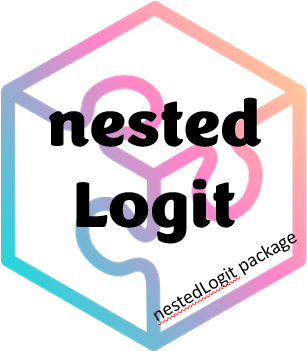

<!-- README.md is generated from README.Rmd. Please edit that file -->

```{r setup, include = FALSE}
knitr::opts_chunk$set(
  collapse = TRUE,
  warning = FALSE,
  comment = "#>",
  fig.path = "man/figures/README-",
  fig.height = 5,
  fig.width = 5
#  out.width = "100%"
)

library(nestedLogit)
```

<!-- badges: start -->
[](https://lifecycle.r-lib.org/articles/stages.html#stable)
[](https://github.com/friendly/nestedLogit)
[](https://cran.r-project.org/package=nestedLogit)
[](https://www.r-pkg.org:443/pkg/nestedLogit)

<!-- badges: end -->

# nestedLogit 
**Version 0.2.1**

The `nestedLogit` package provides functions for fitting nested dichotomy logistic regression models
for a polytomous response. Nested dichotomies are statistically independent, and hence provide an
additive decomposition of tests for the overall polytomous response. When the dichotomies make
sense substantively, this method can be a simpler alternative to the standard multinomial logistic model
which compares response categories to a reference level.

## Installation

The package is now available on CRAN.
This development version can be installed to your R library directly from the [GitHub repo](https://github.com/friendly/nestedLogit) via:

```
install.packages("nestedLogit")

# or, devel version
if (!require(remotes)) install.packages("remotes")
remotes::install_github("friendly/nestedLogit", build_vignettes = TRUE)
```


## Package overview

The package provides one main function, `nestedLogit()` for fitting the set of $(m-1)$
binary logistic regression models for a polytomous response with $m$ levels.
These can be specified using helper functions,

* `dichotomy()`: constructs a _single_ dichotomy among the levels of a response factor;
* `logits()`: creates the set of dichotomies, typically using `dichotomy()` for each.
* `continuationLogits()`: provides a convenient way to generate all dichotomies for an ordered response.

For instance, a 4-category response, with levels `r LETTERS[1:4]`, and successive binary splits
for the dichotomies of interest
could be specified as:


```{r}
(ABCD <-
  logits(AB.CD = dichotomy(c("A", "B"), c("C", "D")),
           A.B = dichotomy("A", "B"),
           C.D = dichotomy("C", "D")
         )
)
```

These dichotomies are effectively a tree structure of lists, which can be displayed simply using
`lobstr::tree()`.

```{r tree}
lobstr::tree(ABCD)
```


Alternatively, the nested dichotomies can be specified more compactly as a nested (i.e., recursive) list 
with optionally named elements. For example, where people might choose a method of transportation
among the categories `plane`, `train`, `bus`, `car`, a sensible set of three dichotomies could
be specified as:

```{r transport}
transport <- list(
  air = "plane",
  ground = list(
    public = list("train", "bus"),
    private = "car"
  ))

lobstr::tree(transport)
```


There are also methods including `as.matrix.dichotomies()`, `as.character.dichotomies()`
to facilitate working with `dichotomies` objects in other representations. The `ABCD` example
above corresponds to the matrix below, whose rows represent the dichotomies and columns
are the response levels:

```{r}
as.matrix(ABCD)

as.character(ABCD)
```


The result of `nestedLogit()` is an object of class `"nestedLogit"`. It contains
the set of $(m-1)$ `glm()` models fit to the dichotomies.

### Methods

```{r child="man/partials/methods.Rmd"}
```


## Examples

This example uses data on women's labor force participation to fit a nested logit model for
the response, `partic`, representing categories
`not.work`, `parttime` and `fulltime` for 263 women from a 1977
survey in Canada. This dataset is explored in more detail in the
package vignette, `vignette("nestedLogits", package = "nestedLogit")`.

A model for the complete polytomy can be specified as two nested
dichotomies, using helper functions `dichotomy()` and `logits()`, as shown in the example that follows:

* `work`: {not.work} vs. {parttime, fulltime}
* `full`: {parttime} vs. {fulltime}, but only for those working

`nestedLogit()` effectively fits each of these dichotomies
as logistic regression models via `glm(..., family = binomial)`

```{r wlf-model}
data(Womenlf, package = "carData")

# Use `logits()` and `dichotomy()` to specify the comparisons of interest
comparisons <- logits(work=dichotomy("not.work", 
                                     working=c("parttime", "fulltime")),
                      full=dichotomy("parttime", "fulltime"))

m <- nestedLogit(partic ~ hincome + children,
                 dichotomies = comparisons,
                 data=Womenlf)
coef(m)
```
The `"nestedLogit"` object contains the components of the fitted model. The structure can be shown nicely
using `lobstr::tree()`:

```{r}
m |> lobstr::tree(max_depth=1)
```

The separate models for the `work` and `full` dichotomies can be extracted via `models()`. These
are the binomial `glm()` models.
```{r}
models(m) |> lobstr::tree(max_depth = 1)
```

`Anova()` produces analysis of variance deviance tests for the terms in this model for each of the submodels, as well as for the combined responses of the polytomy. The `LR Chisq` and `df` for terms in the combined model are the sums of those for
the submodels.


```{r wlf-anova}
car::Anova(m)
```

### Plots
A basic plot of predicted probabilities can be produced using
the `plot()` method for `"nestedLogit"` objects.
It can be called several times to give multi-panel plots.

```{r wlf-plot}
#| out.width = "100%",
#| fig.height = 4,
#| echo = 1:3
op <- par(mfcol=c(1, 2), mar=c(4, 4, 3, 1) + 0.1)
plot(m, "hincome", list(children="absent"),
     xlab="Husband's Income", legend=FALSE)
plot(m, "hincome", list(children="present"),
     xlab="Husband's Income")
par(op)
```

## Vignettes

* A more general discussion of nested dichotomies logistic regression and detailed examples can be found in 
`vignette("nestedLogit", package="nestedLogit")`

* A variety of other plots can be produced using base graphics (`matplot()`) and `ggplot()`, as described in the vignette,
`vignette("plotting", package="nestedLogit")`.


## Authors
* John Fox
* Michael Friendly

## References

S. Fienberg (1980) _The Analysis of Cross-Classified Categorical Data_, 2nd Edition, MIT Press, Section 6.6.

J. Fox (2016) _Applied Regression Analysis and Generalized Linear Models_, 3rd Edition, Sage, Section 14.2.2.

M. Friendly and D. Meyers (2016) _Discrete Data Analysis with R_, CRC Press, Section 8.2.
