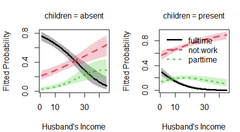

<!-- README.md is generated from README.Rmd. Please edit that file.
     When version changes, install the package before re-kniting so the deve version is up-to-date
-->

<!-- badges: start -->

[](https://lifecycle.r-lib.org/articles/stages.html#stable)
[](https://github.com/friendly/nestedLogit)
[](https://cran.r-project.org/package=nestedLogit)
[](https://www.r-pkg.org:443/pkg/nestedLogit)
[](https://friendly.github.io/nestedLogit)

<!-- badges: end -->

# nestedLogit 

<!-- **Version 0.3.4** -->

**Version 0.3.4**; documentation built for `pkgdown` 2026-02-01

The `nestedLogit` package provides functions for fitting *nested
dichotomy* logistic regression models for a **polytomous** response
(with $m > 2$ categories), such as:

- support for political party in Canada (PC, Liberal, NDP, Green, BQ),
- preferred mode of transport (foot, bus, bike, train, plane),
- womens’ working status (not working, part-time, full-time).

The figure below shows two different ways that a $m=4$-category
polytomous response $Y = \{1, 2, 3, 4\}$ can be decomposed as three
($m-1$) nested dichotomies among the levels.

- In the case shown at the left of the figure, the response categories
  are divided first as $\{1, 2\}$ vs. $\{3, 4\}$. Then these compound
  categories are subdivided as the dichotomies $\{1\}$ vs. $\{2\}$ and
  as $\{3\}$ vs. $\{4\}$.
- Alternatively, as shown at the right of the figure, the response
  categories are divided progressively: first as $\{1\}$
  vs. $\{2, 3, 4\}$; next as $\{2\}$ vs. $\{3, 4\}$; and and finally
  $\{3\}$ vs. $\{4\}$.

<div class="figure">


<p class="caption">

**Nested dichotomies**: The boxes show two different ways a
four-category response can be represented as three nested dichotomies.
</p>

</div>

The basic model for this situation is the standard **multinomial
logistic model** (fit by: e.g., `nnet::multinom()`) which compares
response categories to a *reference level*. When you can think of the
differences among the response categories as a set nested comparisons
among subsets of the categories, the approach of nested dichotomies is
simpler, because:

- Nested dichotomies are statistically independent, and hence:
- the likelihood chi-square statistics for the sub-models are additive;
- they provide an additive decomposition of tests for the overall
  polytomous response.
- You can think of this as breaking up the overall question of “How do
  the response categories differ?” into $m-1$ sub-questions that answer
  the global one.

When the dichotomies make sense substantively, this method can be a
simpler alternative to the standard **multinomial logistic model** which
compares response categories to a reference level. This choice is
similar to using **orthogonal contrasts** among factor categories in an
ANOVA, as opposed to using the default reference-level coding.

### Ordered categories

Note that when the response catgegories are **ordered**, as in education
attained: “HS” \< “College” \< “BA” \< “MA” \< “Phd”, another attractive
model is the **proportional odds** model (e.g., fit by `MASS::polr()`).
This is a simpler model, but achieves that simplicity by making the
additional assumption that the coefficients for the predictors are the
same for all categories.

## Installation

You can install the current published version (0.3.2) from
[CRAN](https://cran.r-project.org/package=nestedLogit), or the
development version (0.3.4) from either
[R-universe](https://friendly.r-universe.dev/nestedLogit) or
[Github](https://github.com/friendly/nestedLogit)

|  |  |
|----|----|
| CRAN version | `install.packages("nestedLogit")` |
| R-universe | `install.packages('nestedLogit', repos = 'https://friendly.r-universe.dev')` |
| Github | `remotes::install_github("friendly/nestedLogit")` |

## Package overview

The package provides one main function, `nestedLogit()` for fitting the
set of $(m-1)$ binary logistic regression models for a polytomous
response with $m$ levels. These can be specified using helper functions,

- `dichotomy()`: constructs a *single* dichotomy among the levels of a
  response factor;
- `logits()`: creates the set of dichotomies, typically using
  `dichotomy()` for each.
- `continuationLogits()`: provides a convenient way to generate all
  dichotomies for an ordered response.

For instance, a 4-category response, with levels A, B, C, D, and
successive binary splits for the dichotomies of interest could be
specified as:

``` r
(ABCD <-
  logits(AB.CD = dichotomy(c("A", "B"), c("C", "D")),
           A.B = dichotomy("A", "B"),
           C.D = dichotomy("C", "D")
         )
)
#> AB.CD: {A, B} vs. {C, D}
#> A.B: {A} vs. {B}
#> C.D: {C} vs. {D}
```

These dichotomies are effectively a tree structure of lists, which can
be displayed simply using `lobstr::tree()`.

``` r
lobstr::tree(ABCD)
#> S3<dichotomies>
#> ├─AB.CD: <list>
#> │ ├─<chr [2]>"A", "B"
#> │ └─<chr [2]>"C", "D"
#> ├─A.B: <list>
#> │ ├─"A"
#> │ └─"B"
#> └─C.D: <list>
#>   ├─"C"
#>   └─"D"
```

Alternatively, the nested dichotomies can be specified more compactly as
a nested (i.e., recursive) list with optionally named elements. For
example, where people might choose a method of transportation among the
categories `plane`, `train`, `bus`, `car`, a sensible set of three
dichotomies could be specified as:

``` r
transport <- list(
  air = "plane",
  ground = list(
    public = list("train", "bus"),
    private = "car"
  ))

lobstr::tree(transport)
#> <list>
#> ├─air: "plane"
#> └─ground: <list>
#>   ├─public: <list>
#>   │ ├─"train"
#>   │ └─"bus"
#>   └─private: "car"
```

There are also methods including `as.matrix.dichotomies()`,
`as.character.dichotomies()` to facilitate working with `dichotomies`
objects in other representations. The `ABCD` example above corresponds
to the matrix below, whose rows represent the dichotomies and columns
are the response levels:

``` r
as.matrix(ABCD)
#>        A  B  C  D
#> AB.CD  0  0  1  1
#> A.B    0  1 NA NA
#> C.D   NA NA  0  1

as.character(ABCD)
#> [1] "AB.CD = {{A B}} {{C D}}; A.B = {{A}} {{B}}; C.D = {{C}} {{D}}"
```

The result of `nestedLogit()` is an object of class `"nestedLogit"`. It
contains the set of $(m-1)$ `glm()` models fit to the dichotomies.

### Methods

As befits a model-fitting function, the package defines a nearly
complete set of methods for `"nestedLogit"` objects:

- `print()` and `summary()` print the results for each of the submodels.
- `update()` re-fits the model, allowing changes to the model `formula`,
  `data`, `subset`, and `contrasts` arguments.
- `coef()` returns the coefficients for the predictors in each
  dichotomy.
- `vcov()` returns the variance-covariance matrix of the coefficients
- `predict()` computes predicted probabilities for the response
  categories, either for the cases in the data, which is equivalent to
  `fitted()`, or for arbitrary combinations of the predictors; the
  latter is useful for producing plots to aid interpretation.
- `confint()` calculates confidence intervals for the predicted
  probabilities or predicted logits.
- `as.data.frame()` method for predicted probabilities and logits
  converts these to long format for use with `ggplot2`.
- `glance()` and `tidy()` are extensions of `broom::glance.glm()` and
  `broom::tidy.glm()` to obtain compact summaries of a `"nestedLogit"`
  model object.
- `plot()` provides basic plots of the predicted probabilities over a
  range of values of the predictor variables.
- `models()` is an extractor function for the binary logit models in the
  `"nestedLogit"` object
- `Effect()` calculates marginal effects collapsed over some variable(s)
  for the purpose of making effect plots.

These functions are supplemented by various methods for testing
hypotheses about and comparing nested-logit models:

- `anova()` provides analysis-of-deviance Type I (sequential) tests for
  each dichotomy and for the combined model. When given a sequence of
  model objects, `anova()` tests the models against one another in the
  order specified.
- `Anova()` uses `car::Anova()` to provide analysis-of-deviance Type II
  or III (partial) tests for each dichotomy and for the combined model.
- `linearHypothesis()` uses `car::linearHypothesis()` to compute Wald
  tests for hypotheses about coefficients or their linear combinations.
- `logLik()` returns the log-likelihood and degrees of freedom for the
  nested-dichotomies logit model.
- Through `logLik()`, the `AIC()` and `BIC()` functions compute the
  Akaike and Bayesian information criteria model-comparison statistics.

## Examples

This example uses data on women’s labor force participation to fit a
nested logit model for the response, `partic`, representing categories
`not.work`, `parttime` and `fulltime` for 263 women from a 1977 survey
in Canada. This dataset is explored in more detail in the package
vignette, `vignette("nestedLogits", package = "nestedLogit")`.

A model for the complete polytomy can be specified as two nested
dichotomies, using helper functions `dichotomy()` and `logits()`, as
shown in the example that follows:

- `work`: {not.work} vs. {parttime, fulltime}
- `full`: {parttime} vs. {fulltime}, but only for those working

`nestedLogit()` effectively fits each of these dichotomies as logistic
regression models via `glm(..., family = binomial)`

``` r
data(Womenlf, package = "carData")

# Use `logits()` and `dichotomy()` to specify the comparisons of interest
comparisons <- logits(work=dichotomy("not.work", 
                                     working=c("parttime", "fulltime")),
                      full=dichotomy("parttime", "fulltime"))

m <- nestedLogit(partic ~ hincome + children,
                 dichotomies = comparisons,
                 data=Womenlf)
coef(m)
#>                        work       full
#> (Intercept)      1.33582979  3.4777735
#> hincome         -0.04230843 -0.1072679
#> childrenpresent -1.57564843 -2.6514557
```

The `"nestedLogit"` object contains the components of the fitted model.
The structure can be shown nicely using `lobstr::tree()`:

``` r
m |> lobstr::tree(max_depth=1)
#> S3<nestedLogit>
#> ├─models: <list>...
#> ├─formula: S3<formula> partic ~ hincome + children...
#> ├─dichotomies: S3<dichotomies>...
#> ├─data: S3<data.frame>...
#> ├─data.name: <symbol> Womenlf
#> ├─subset: <NULL>
#> ├─contrasts: <NULL>
#> └─contrasts.print: "NULL"
```

The separate models for the `work` and `full` dichotomies can be
extracted via `models()`. These are the binomial `glm()` models.

``` r
models(m) |> lobstr::tree(max_depth = 1)
#> <list>
#> ├─work: S3<glm/lm>...
#> └─full: S3<glm/lm>...
```

`Anova()` produces analysis of variance deviance tests for the terms in
this model for each of the submodels, as well as for the combined
responses of the polytomy. The `LR Chisq` and `df` for terms in the
combined model are the sums of those for the submodels.

``` r
car::Anova(m)
#> 
#>  Analysis of Deviance Tables (Type II tests)
#>  
#> Response work: {not.work} vs. working{parttime, fulltime}
#>          LR Chisq Df Pr(>Chisq)    
#> hincome    4.8264  1    0.02803 *  
#> children  31.3229  1  2.185e-08 ***
#> ---
#> Signif. codes:  0 '***' 0.001 '**' 0.01 '*' 0.05 '.' 0.1 ' ' 1
#> 
#> 
#> Response full: {parttime} vs. {fulltime}
#>          LR Chisq Df Pr(>Chisq)    
#> hincome     8.981  1   0.002728 ** 
#> children   32.136  1  1.437e-08 ***
#> ---
#> Signif. codes:  0 '***' 0.001 '**' 0.01 '*' 0.05 '.' 0.1 ' ' 1
#> 
#> 
#> Combined Responses
#>          LR Chisq Df Pr(>Chisq)    
#> hincome    13.808  2   0.001004 ** 
#> children   63.459  2   1.66e-14 ***
#> ---
#> Signif. codes:  0 '***' 0.001 '**' 0.01 '*' 0.05 '.' 0.1 ' ' 1
```

### Plots

A basic plot of predicted probabilities can be produced using the
`plot()` method for `"nestedLogit"` objects. It can be called several
times to give multi-panel plots. By default, a 95% pointwise confidence
envelope is added to the plot. Here, they are plotted with
`conf.level = 0.68` to give $\pm 1$ std. error bounds.

``` r
op <- par(mfcol=c(1, 2), mar=c(4, 4, 3, 1) + 0.1)
plot(m, "hincome", list(children="absent"),
     conf.level = 0.68,
     xlab="Husband's Income", legend=FALSE)
plot(m, "hincome", list(children="present"),
     conf.level = 0.68,
     xlab="Husband's Income")
```



## Vignettes

- A more general discussion of nested dichotomies logistic regression
  and detailed examples can be found in `vignette("nestedLogit")`

- A variety of other plots can be produced using `ggplot()`, as
  described in the vignette, `vignette("plotting-ggplot")`.

- A new vignette, “`vignette("standard-errors")`, describes the
  mathematics behind the calculation of standard errors using the delta
  method.

## Authors

- John Fox
- Michael Friendly

## References

S. Fienberg (1980) *The Analysis of Cross-Classified Categorical Data*,
2nd Edition, MIT Press, Section 6.6.

J. Fox (2016) *Applied Regression Analysis and Generalized Linear
Models*, 3rd Edition, Sage, Section 14.2.2.

M. Friendly and D. Meyers (2016) *Discrete Data Analysis with R*, CRC
Press, Section 8.2.
