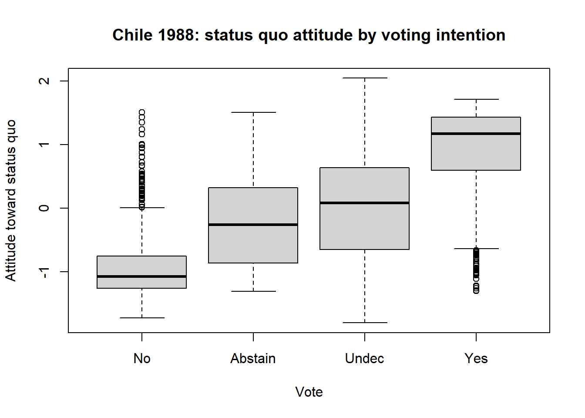
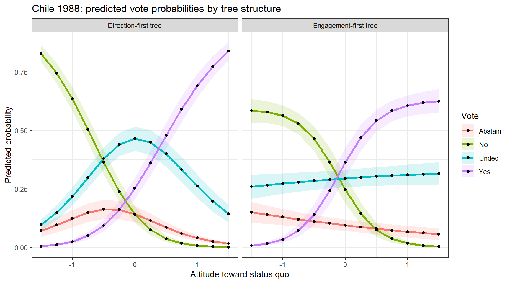
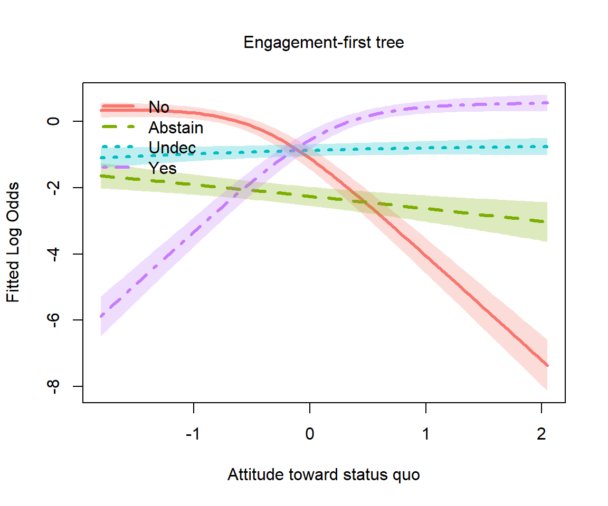
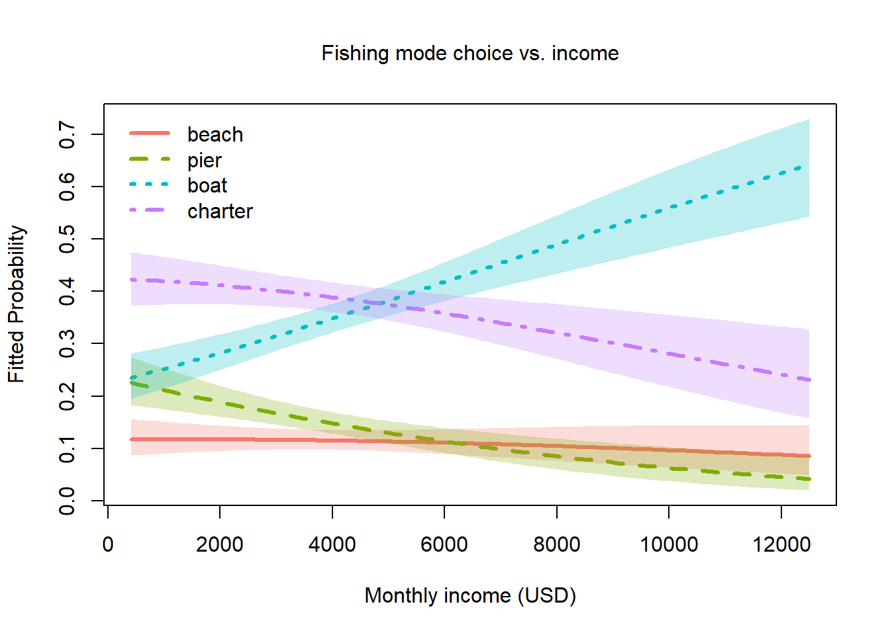
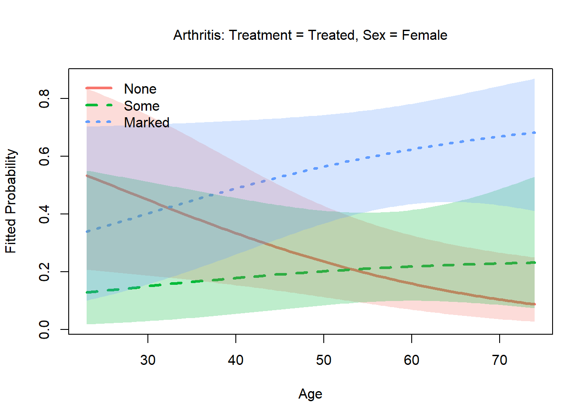
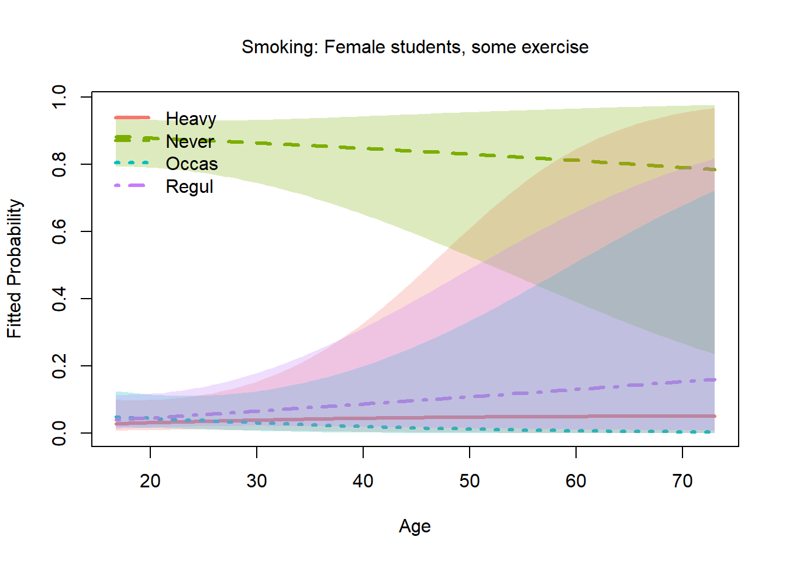

# Other Examples of Nested Logit Models

## Introduction

This document explores datasets beyond those already packaged with
`nestedLogit` (`Womenlf`, `GSS`, `gators`, `HealthInsurance`) that could
profit from treatment as nested logit models, either because:

- the response categories have a natural **hierarchical tree structure**
  and the independence-of-irrelevant-alternatives (IIA) assumption of
  plain multinomial logit is implausible across nests, or

- the response is **ordinal** and **continuation logits** (a special
  case of nested dichotomies) are a natural model, and the
  **proportional odds** model (which assumes equal slopes for the
  predictors) might not be likely to hold.

From a scan of suitable datasets in available packages, the best
candidates identified for this vignette are:

| Dataset        | Package | Response levels         | Structure            | N    |
|----------------|---------|-------------------------|----------------------|------|
| `Chile`        | carData | Abstain/No/Undec/Yes    | two competing trees  | 2700 |
| `TravelMode`   | AER     | air/train/bus/car       | IIA violation        | 210  |
| `Fishing`      | mlogit  | beach/pier/boat/charter | shore vs. vessel     | 1182 |
| `Arthritis`    | vcd     | None/Some/Marked        | ordinal continuation | 84   |
| `survey$Smoke` | MASS    | Never/Occas/Regul/Heavy | ordinal continuation | 237  |
| `pneumo`       | VGAM    | normal/mild/severe      | ordinal continuation | 8    |

``` r
library(nestedLogit)
library(nnet)       # multinom()
library(car)        # Anova()
library(ggplot2)
```

------------------------------------------------------------------------

## Chilean plebiscite voting intent (`carData::Chile`)

### Data

The September, 1988 Chilean national plebiscite asked citizens whether
the military government of Augusto Pinochet should remain in power for
another eight years. Six months before that, the independent research
center FLASCO/Chile conducted a national survey of 27000 randomly
selected voters. The main question concerned their intention to vote
(`vote`) in the plebiscite, which was recorded as:

- **Yes** (support Pinochet)
- **No** (oppose Pinochet)
- **Undec** (undecided)
- **Abstain** (abstain / not vote)

\[The levels of `Chile$vote` are actually just the first letters: “Y”,
“N”, “U”, “A”. For ease of interpretation, these are recoded in a step
below.\]

`Chile` is in `carData`, which is already a Suggests: dependency of
`nestedLogit`, so no extra package is needed. One main predictor is a
standardized scale of support for the `statusquo`, where high values
represent general support for the policies of the military regime. Other
predictors are: `sex`, `age`, `education` (a factor) and `income` of the
respondents.

``` r
data("Chile", package = "carData")
str(Chile)
#> 'data.frame':    2700 obs. of  8 variables:
#>  $ region    : Factor w/ 5 levels "C","M","N","S",..: 3 3 3 3 3 3 3 3 3 3 ...
#>  $ population: int  175000 175000 175000 175000 175000 175000 175000 175000 175000 175000 ...
#>  $ sex       : Factor w/ 2 levels "F","M": 2 2 1 1 1 1 2 1 1 2 ...
#>  $ age       : int  65 29 38 49 23 28 26 24 41 41 ...
#>  $ education : Factor w/ 3 levels "P","PS","S": 1 2 1 1 3 1 2 3 1 1 ...
#>  $ income    : int  35000 7500 15000 35000 35000 7500 35000 15000 15000 15000 ...
#>  $ statusquo : num  1.01 -1.3 1.23 -1.03 -1.1 ...
#>  $ vote      : Factor w/ 4 levels "A","N","U","Y": 4 2 4 2 2 2 2 2 3 2 ...
```

The dataset contains missing values on a number of predictors, but there
were 168 cases who did not answer the voting intention question. These
are dropped here, so that all models use the same cases.

``` r
colSums(is.na(Chile))
#>     region population        sex        age  education     income  statusquo 
#>          0          0          0          1         11         98         17 
#>       vote 
#>        168

# Drop the 168 rows with missing vote so all models use the same cases
chile <- Chile[!is.na(Chile$vote), ]

# Recode vote with longer labels, ordered by median statusquo (No < Abstain < Undec < Yes)
chile$vote <- factor(chile$vote,
                     levels = c("N", "A", "U", "Y"),
                     labels = c("No", "Abstain", "Undec", "Yes"))
nrow(chile)
#> [1] 2532
table(chile$vote)
#> 
#>      No Abstain   Undec     Yes 
#>     889     187     588     868
```

The strong predictor `statusquo` is a scale measuring attitude toward
the political status quo (higher = more supportive of Pinochet’s
regime).

``` r
# statusquo distribution by vote
boxplot(statusquo ~ vote, data = chile,
        xlab = "Vote", ylab = "Attitude toward status quo",
        main  = "Chile 1988: status quo attitude by voting intention")
```



With this reordering of the response levels, a clear pattern emerges in
the boxplot. But, also note how the shapes of the distributions change,
and the presence of outliers. But here, the goal is to explain voting
intention using the other predictors.

### Two competing tree structures

The four `vote` categories may seem to be unordered in the general case.
However, we can think more productively about the underlying process for
a respondent that leads to their choice. A key theoretical question is
the **ordering of the decision process**, which gives rise to two
different sets of nested comparisons.

#### Engagement-first tree

The voter first decides whether to participate meaningfully (cast a Yes
or No vote) vs. disengage (Abstain or remain Undecided). Engagement is
then governed by demographic/civic variables; direction by political
attitude.

                vote
               /    \
           engaged  disengaged
           /   \     /      \
         Yes    No Abstain  Undec

We specify this as three nested dichotomies:

``` r
dichots_eng <- logits(
  engage    = dichotomy(engaged    = c("Yes", "No"),
                        disengaged = c("Abstain", "Undec")),
  direction = dichotomy("Yes", "No"),
  disengage = dichotomy("Abstain", "Undec")
)

# print method
dichots_eng
#> engage: engaged{Yes, No} vs. disengaged{Abstain, Undec}
#> direction: {Yes} vs. {No}
#> disengage: {Abstain} vs. {Undec}

# print as an ASCII tree
as.tree(dichots_eng, response = "vote")
#>       vote
#>     /        \
#> engaged  disengaged
#>   /  \      /    \
#> Yes  No Abstain Undec
```

#### Direction-first tree

The voter first forms a political opinion (pro or anti status quo) and
only then decides whether to act on it. `statusquo` should dominate the
direction split; demographics should govern the two engagement splits.

              vote
             /    \
           pro    anti
          /   \   /      \
        Yes  Undec No  Abstain

These dichotomies are specified as follows:

``` r
dichots_dir <- logits(
  direction  = dichotomy(pro  = c("Yes", "Undec"),
                         anti = c("No", "Abstain")),
  engage_pro = dichotomy("Yes", "Undec"),
  engage_ant = dichotomy("No", "Abstain")
)
dichots_dir
#> direction: pro{Yes, Undec} vs. anti{No, Abstain}
#> engage_pro: {Yes} vs. {Undec}
#> engage_ant: {No} vs. {Abstain}
```

### Fitting the models

For comparison, we can fit the standard multinomial logistic regression
models (using `"N"` as the baseline category) and the two nested
dichotomy models. I use the main effects of the principal predictors
(ignoring `region` and `population`) in all three models.

``` r
mod.formula <- vote ~ statusquo + age + sex + education + income

# Multinomial logit baseline (reference = "No")
chile2 <- within(chile, vote <- relevel(vote, ref = "No"))
chile_multi <- multinom(mod.formula, data = chile2, trace = FALSE)

# Nested logit: engagement-first tree
chile_eng <- nestedLogit(mod.formula, dichotomies = dichots_eng, data = chile)

# Nested logit: direction-first tree
chile_dir <- nestedLogit(mod.formula, dichotomies = dichots_dir, data = chile)
```

Details of this analysis are provided by
[`summary()`](https://rdrr.io/r/base/summary.html), which provides tests
of coefficients as well as overall measures of fit (residual deviance)
for each dichotomy as well as for the combined models comprising all
four vote choices. This output is suppressed here

``` r
summary(chile_eng)
summary(chile_dir)
```

#### Omnibus tests

[`car::Anova()`](https://rdrr.io/pkg/car/man/Anova.html) gives $`G^2`$
tests for each term in the submodels for the dichotomies as well as
tests for these terms in the combined model.

``` r
Anova(chile_eng)
#> 
#>  Analysis of Deviance Tables (Type II tests)
#>  
#> Response engage: engaged{Yes, No} vs. disengaged{Abstain, Undec}
#>           LR Chisq Df Pr(>Chisq)    
#> statusquo   1.3414  1  0.2467943    
#> age         0.7603  1  0.3832292    
#> sex        26.2651  1  2.976e-07 ***
#> education  15.7693  2  0.0003765 ***
#> income     11.6642  1  0.0006371 ***
#> ---
#> Signif. codes:  0 '***' 0.001 '**' 0.01 '*' 0.05 '.' 0.1 ' ' 1
#> 
#> 
#> Response direction: {Yes} vs. {No}
#>           LR Chisq Df Pr(>Chisq)    
#> statusquo  1530.80  1  < 2.2e-16 ***
#> age           0.03  1   0.866346    
#> sex           8.06  1   0.004522 ** 
#> education     9.96  2   0.006888 ** 
#> income        0.71  1   0.398223    
#> ---
#> Signif. codes:  0 '***' 0.001 '**' 0.01 '*' 0.05 '.' 0.1 ' ' 1
#> 
#> 
#> Response disengage: {Abstain} vs. {Undec}
#>           LR Chisq Df Pr(>Chisq)    
#> statusquo  10.8037  1   0.001013 ** 
#> age        16.0449  1  6.186e-05 ***
#> sex         3.2513  1   0.071368 .  
#> education   9.1231  2   0.010446 *  
#> income      0.7965  1   0.372148    
#> ---
#> Signif. codes:  0 '***' 0.001 '**' 0.01 '*' 0.05 '.' 0.1 ' ' 1
#> 
#> 
#> Combined Responses
#>           LR Chisq Df Pr(>Chisq)    
#> statusquo  1542.95  3  < 2.2e-16 ***
#> age          16.83  3  0.0007647 ***
#> sex          37.58  3  3.472e-08 ***
#> education    34.85  6  4.611e-06 ***
#> income       13.17  3  0.0042743 ** 
#> ---
#> Signif. codes:  0 '***' 0.001 '**' 0.01 '*' 0.05 '.' 0.1 ' ' 1
Anova(chile_dir)
#> 
#>  Analysis of Deviance Tables (Type II tests)
#>  
#> Response direction: pro{Yes, Undec} vs. anti{No, Abstain}
#>           LR Chisq Df Pr(>Chisq)    
#> statusquo  1258.66  1  < 2.2e-16 ***
#> age          16.01  1  6.307e-05 ***
#> sex          32.93  1  9.547e-09 ***
#> education    21.40  2  2.253e-05 ***
#> income        3.14  1    0.07658 .  
#> ---
#> Signif. codes:  0 '***' 0.001 '**' 0.01 '*' 0.05 '.' 0.1 ' ' 1
#> 
#> 
#> Response engage_pro: {Yes} vs. {Undec}
#>           LR Chisq Df Pr(>Chisq)    
#> statusquo   407.74  1    < 2e-16 ***
#> age           2.80  1    0.09397 .  
#> sex           1.42  1    0.23359    
#> education     1.78  2    0.41054    
#> income        4.97  1    0.02583 *  
#> ---
#> Signif. codes:  0 '***' 0.001 '**' 0.01 '*' 0.05 '.' 0.1 ' ' 1
#> 
#> 
#> Response engage_ant: {No} vs. {Abstain}
#>           LR Chisq Df Pr(>Chisq)    
#> statusquo  166.552  1  < 2.2e-16 ***
#> age          0.491  1  0.4834296    
#> sex         11.660  1  0.0006386 ***
#> education    3.463  2  0.1770562    
#> income       1.772  1  0.1831203    
#> ---
#> Signif. codes:  0 '***' 0.001 '**' 0.01 '*' 0.05 '.' 0.1 ' ' 1
#> 
#> 
#> Combined Responses
#>           LR Chisq Df Pr(>Chisq)    
#> statusquo  1832.96  3  < 2.2e-16 ***
#> age          19.30  3  0.0002365 ***
#> sex          46.01  3  5.643e-10 ***
#> education    26.64  6  0.0001688 ***
#> income        9.88  3  0.0196527 *  
#> ---
#> Signif. codes:  0 '***' 0.001 '**' 0.01 '*' 0.05 '.' 0.1 ' ' 1
```

### Which tree fits better?

Both nested models and the multinomial model have identical parameter
counts (5 predictors × 3 sub-models = 15 slopes plus 3 intercepts), so
AIC is a fair comparison.

``` r
data.frame(
  model   = c("Multinomial", "Engagement tree", "Direction tree"),
  logLik  = c(logLik(chile_multi), logLik(chile_eng), logLik(chile_dir)),
  AIC     = c(AIC(chile_multi),    AIC(chile_eng),    AIC(chile_dir))
)
#>             model    logLik      AIC
#> 1     Multinomial -2018.685 4079.370
#> 2 Engagement tree -2172.343 4386.686
#> 3  Direction tree -2027.276 4096.553
```

The direction-first tree should fit better (as it does) if `statusquo`
is primarily a predictor of political opinion (Y/N vs. U/A) rather than
of engagement. We can check this by inspecting the `statusquo`
coefficients in each sub-model of the engagement tree: they should be
large in `direction` and small in `engage` and `disengage`.

### Predicted probabilities

To visualize these models, it is useful to calculate the predicted
probabilities of `vote` choice over a range of predictor values, holding
constant (averaging over) the predictor we don’t want to display in a
given plot

``` r
new_chile <- data.frame(
  statusquo = seq(-1.5, 1.5, by = 0.25),
  age       = median(chile$age,    na.rm = TRUE),
  sex       = factor("F",  levels = levels(chile$sex)),
  education = factor("S",  levels = levels(chile$education)),
  income    = median(chile$income, na.rm = TRUE)
)
```

We can get the predicted probabilities for these separate models for the
dichotomies using
[`predict.nestedLogit()`](https://friendly.github.io/nestedLogit/reference/predict.nestedLogit.md)
and turning these into data frames for plotting with `ggplot2`.

``` r
pred_eng <- as.data.frame(predict(chile_eng, newdata = new_chile))
pred_dir <- as.data.frame(predict(chile_dir, newdata = new_chile))
```

``` r
# as.data.frame() returns long format: one row per (observation × response level)
# with predictor columns, plus 'response', 'p', 'se.p', 'logit', 'se.logit'
pred_long <- rbind(
  transform(pred_eng, model = "Engagement-first tree"),
  transform(pred_dir, model = "Direction-first tree")
)

ggplot(pred_long, aes(x = statusquo, y = p, colour = response, fill = response)) +
  geom_ribbon(aes(ymin = pmax(0, p - 1.96 * se.p),
                  ymax = pmin(1, p + 1.96 * se.p)),
              alpha = 0.15, colour = NA) +
  geom_line(linewidth = 1.2) +
  geom_point(color = "blacK") +
  facet_wrap(~ model) +
  labs(x      = "Attitude toward status quo",
       y      = "Predicted probability",
       colour = "Vote", fill = "Vote",
       title  = "Chile 1988: predicted vote probabilities by tree structure") +
  theme_bw()
```



This is substantively interesting, because the two different structures
for the dichotomy comparisons give quite different views of the
predictions from the models.

#### Plotting logits

Using the
[`plot.nestedLogit()`](https://friendly.github.io/nestedLogit/reference/plot.nestedLogit.md)
method, we can also show these on the logit scale, using the
`scale = "logit"` argument. There are other niceties, not shown here,
such as using direct labels on the curves (`label = TRUE`, `label.x`)
rather than a legend.

``` r
# Logit-scale plot using the new scale= argument
plot(chile_eng, "statusquo",
     others = list(age       = median(chile$age, na.rm = TRUE),
                   sex       = "F",
                   education = "S",
                   income    = median(chile$income, na.rm = TRUE)),
     scale  = "logit",
     xlab   = "Attitude toward status quo",
     main   = "Engagement-first tree")
```



------------------------------------------------------------------------

## Travel mode choice (`AER::TravelMode`)

The dataset
[`AER::TravelMode`](https://rdrr.io/pkg/AER/man/TravelMode.html) is a
classic in econometrics, originally from Greene (2003). It relates to
the mode of travel chosen by individuals for travel between Sydney and
Melbourne, Australia.

- Do they choose to go by “car”, “air”, “train”, or “bus”?
- How do variables like cost, waiting time, household income influence
  that choice?

This section requires the `AER` and `dplyr` packages.

``` r
library(AER)
library(dplyr)
data("TravelMode", package = "AER")
str(TravelMode)
#> 'data.frame':    840 obs. of  9 variables:
#>  $ individual: Factor w/ 210 levels "1","2","3","4",..: 1 1 1 1 2 2 2 2 3 3 ...
#>  $ mode      : Factor w/ 4 levels "air","train",..: 1 2 3 4 1 2 3 4 1 2 ...
#>  $ choice    : Factor w/ 2 levels "no","yes": 1 1 1 2 1 1 1 2 1 1 ...
#>  $ wait      : int  69 34 35 0 64 44 53 0 69 34 ...
#>  $ vcost     : int  59 31 25 10 58 31 25 11 115 98 ...
#>  $ travel    : int  100 372 417 180 68 354 399 255 125 892 ...
#>  $ gcost     : int  70 71 70 30 68 84 85 50 129 195 ...
#>  $ income    : int  35 35 35 35 30 30 30 30 40 40 ...
#>  $ size      : int  1 1 1 1 2 2 2 2 1 1 ...
```

### Data structure

`TravelMode` is in **long format**: 840 rows = 210 individuals × 4
travel alternatives (air, train, bus, car). Variables such as `wait` and
`gcost` are *alternative-specific* — they differ across modes for the
same individual.

[`nestedLogit()`](https://friendly.github.io/nestedLogit/reference/nestedLogit.md)
requires **one row per individual** with the chosen mode as the
response. Only **individual-specific** predictors (`income`, `size`)
work here directly; alternative-specific costs would require a different
approach.

``` r
tm <- TravelMode |>
  filter(choice == "yes") |>
  select(mode, income, size) |>
  mutate(mode = relevel(factor(mode), ref = "car"))

table(tm$mode)
#> 
#>   car   air train   bus 
#>    59    58    63    30
```

### Nesting structure

The canonical nested structure separates *private* (car) from *public*
transit, then within public separates *air* from *ground*, then *train*
from *bus*. This reflects the IIA problem: adding a near-identical
alternative (e.g., a second bus service) should not equally reduce the
probability of choosing car.

``` r
travel_dichots <- logits(
  pvt_pub  = dichotomy("car", public = c("air", "train", "bus")),
  air_grnd = dichotomy("air", ground = c("train", "bus")),
  tr_bus   = dichotomy("train", "bus")
)
travel_dichots
#> pvt_pub: {car} vs. public{air, train, bus}
#> air_grnd: {air} vs. ground{train, bus}
#> tr_bus: {train} vs. {bus}
```

### Fitting

``` r
tm_multi  <- multinom(mode ~ income + size, data = tm, trace = FALSE)
tm_nested <- nestedLogit(mode ~ income + size,
                         dichotomies = travel_dichots,
                         data = tm)
summary(tm_nested)
#> Nested logit models: mode ~ income + size
#> 
#> Response pvt_pub: {car} vs. public{air, train, bus}
#> Call:
#> glm(formula = pvt_pub ~ income + size, family = binomial, data = tm, 
#>     contrasts = contrasts)
#> 
#> Coefficients:
#>              Estimate Std. Error z value Pr(>|z|)    
#> (Intercept)  2.826386   0.456924   6.186 6.18e-10 ***
#> income      -0.024565   0.008494  -2.892 0.003828 ** 
#> size        -0.533381   0.157070  -3.396 0.000684 ***
#> ---
#> Signif. codes:  0 '***' 0.001 '**' 0.01 '*' 0.05 '.' 0.1 ' ' 1
#> 
#> (Dispersion parameter for binomial family taken to be 1)
#> 
#>     Null deviance: 249.42  on 209  degrees of freedom
#> Residual deviance: 224.66  on 207  degrees of freedom
#> AIC: 230.66
#> 
#> Number of Fisher Scoring iterations: 4
#> 
#> Response air_grnd: {air} vs. ground{train, bus}
#> Call:
#> glm(formula = air_grnd ~ income + size, family = binomial, data = tm, 
#>     contrasts = contrasts)
#> 
#> Coefficients:
#>             Estimate Std. Error z value Pr(>|z|)    
#> (Intercept)  2.11434    0.53025   3.987 6.68e-05 ***
#> income      -0.04745    0.01011  -4.693 2.69e-06 ***
#> size        -0.04371    0.21852  -0.200    0.841    
#> ---
#> Signif. codes:  0 '***' 0.001 '**' 0.01 '*' 0.05 '.' 0.1 ' ' 1
#> 
#> (Dispersion parameter for binomial family taken to be 1)
#> 
#>     Null deviance: 201.14  on 150  degrees of freedom
#> Residual deviance: 174.72  on 148  degrees of freedom
#>   (59 observations deleted due to missingness)
#> AIC: 180.72
#> 
#> Number of Fisher Scoring iterations: 4
#> 
#> Response tr_bus: {train} vs. {bus}
#> Call:
#> glm(formula = tr_bus ~ income + size, family = binomial, data = tm, 
#>     contrasts = contrasts)
#> 
#> Coefficients:
#>             Estimate Std. Error z value Pr(>|z|)  
#> (Intercept) -0.43907    0.59320  -0.740   0.4592  
#> income       0.02628    0.01347   1.951   0.0511 .
#> size        -0.67379    0.34932  -1.929   0.0538 .
#> ---
#> Signif. codes:  0 '***' 0.001 '**' 0.01 '*' 0.05 '.' 0.1 ' ' 1
#> 
#> (Dispersion parameter for binomial family taken to be 1)
#> 
#>     Null deviance: 116.96  on 92  degrees of freedom
#> Residual deviance: 109.45  on 90  degrees of freedom
#>   (117 observations deleted due to missingness)
#> AIC: 115.45
#> 
#> Number of Fisher Scoring iterations: 4
Anova(tm_nested)
#> 
#>  Analysis of Deviance Tables (Type II tests)
#>  
#> Response pvt_pub: {car} vs. public{air, train, bus}
#>        LR Chisq Df Pr(>Chisq)    
#> income   8.6956  1  0.0031898 ** 
#> size    12.1719  1  0.0004852 ***
#> ---
#> Signif. codes:  0 '***' 0.001 '**' 0.01 '*' 0.05 '.' 0.1 ' ' 1
#> 
#> 
#> Response air_grnd: {air} vs. ground{train, bus}
#>        LR Chisq Df Pr(>Chisq)    
#> income  26.4152  1  2.754e-07 ***
#> size     0.0398  1     0.8418    
#> ---
#> Signif. codes:  0 '***' 0.001 '**' 0.01 '*' 0.05 '.' 0.1 ' ' 1
#> 
#> 
#> Response tr_bus: {train} vs. {bus}
#>        LR Chisq Df Pr(>Chisq)  
#> income   3.9221  1    0.04765 *
#> size     4.5405  1    0.03310 *
#> ---
#> Signif. codes:  0 '***' 0.001 '**' 0.01 '*' 0.05 '.' 0.1 ' ' 1
#> 
#> 
#> Combined Responses
#>        LR Chisq Df Pr(>Chisq)    
#> income   39.033  3  1.708e-08 ***
#> size     16.752  3  0.0007947 ***
#> ---
#> Signif. codes:  0 '***' 0.001 '**' 0.01 '*' 0.05 '.' 0.1 ' ' 1
```

### Predicted probabilities

``` r
new_tm <- data.frame(income = seq(10, 60, by = 10), size = 1)

# as.data.frame() returns long format; reshape to wide for comparison
pred_tm_nested_long <- as.data.frame(predict(tm_nested, newdata = new_tm))
nested_wide <- reshape(
  pred_tm_nested_long[, c("income", "size", "response", "p")],
  idvar     = c("income", "size"),
  timevar   = "response",
  direction = "wide"
)
names(nested_wide) <- sub("^p\\.", "", names(nested_wide))

pred_tm_multi <- as.data.frame(predict(tm_multi, newdata = new_tm,
                                       type = "probs"))

cat("Nested logit:\n")
#> Nested logit:
cbind(income = new_tm$income, round(nested_wide[, levels(tm$mode)], 3))
#>    income   car   air train   bus
#> 1      10 0.114 0.149 0.516 0.221
#> 5      20 0.142 0.211 0.416 0.231
#> 9      30 0.174 0.284 0.315 0.227
#> 13     40 0.212 0.360 0.220 0.207
#> 17     50 0.256 0.427 0.142 0.174
#> 21     60 0.306 0.475 0.084 0.134

cat("Multinomial logit:\n")
#> Multinomial logit:
cbind(income = new_tm$income, round(pred_tm_multi[, levels(tm$mode)], 3))
#>   income   car   air train   bus
#> 1     10 0.105 0.153 0.524 0.218
#> 2     20 0.145 0.220 0.411 0.224
#> 3     30 0.189 0.296 0.301 0.215
#> 4     40 0.229 0.372 0.206 0.192
#> 5     50 0.263 0.442 0.133 0.163
#> 6     60 0.287 0.500 0.082 0.131
```

### Model comparison

``` r
data.frame(
  model  = c("Multinomial", "Nested"),
  logLik = c(logLik(tm_multi), logLik(tm_nested)),
  AIC    = c(AIC(tm_multi),    AIC(tm_nested))
)
#>         model    logLik      AIC
#> 1 Multinomial -253.3408 524.6817
#> 2      Nested -254.4163 526.8327
```

------------------------------------------------------------------------

## Fishing mode choice (`mlogit::Fishing`)

Another classic econometric dataset amenable to nested dichotomies
treatment concerns the choice by recreational anglers among different
modes of fishing: from a beach or pier, or on a boat, that could be
private or a charter.

The dataset is from Herriges & Kling (1999); see also Cameron & Trivedi
(2005) for an econometric treatment.

This section requires the `mlogit` package.

``` r
data("Fishing", package = "mlogit")
str(Fishing)
#> 'data.frame':    1182 obs. of  10 variables:
#>  $ mode         : Factor w/ 4 levels "beach","pier",..: 4 4 3 2 3 4 1 4 3 3 ...
#>  $ price.beach  : num  157.9 15.1 161.9 15.1 106.9 ...
#>  $ price.pier   : num  157.9 15.1 161.9 15.1 106.9 ...
#>  $ price.boat   : num  157.9 10.5 24.3 55.9 41.5 ...
#>  $ price.charter: num  182.9 34.5 59.3 84.9 71 ...
#>  $ catch.beach  : num  0.0678 0.1049 0.5333 0.0678 0.0678 ...
#>  $ catch.pier   : num  0.0503 0.0451 0.4522 0.0789 0.0503 ...
#>  $ catch.boat   : num  0.26 0.157 0.241 0.164 0.108 ...
#>  $ catch.charter: num  0.539 0.467 1.027 0.539 0.324 ...
#>  $ income       : num  7083 1250 3750 2083 4583 ...
```

### Overview

1182 US recreational anglers each chose one of four fishing modes:
`beach`, `pier`, `boat`, `charter`. The natural nesting separates
*shore-based* from *vessel-based* alternatives:

           fishing
          /        \
       shore      vessel
      /     \    /      \
    beach  pier boat  charter

Shore-based modes share unobserved attributes (no boat required, lower
cost and commitment) that vessel-based modes do not, so IIA is plausible
within but not across groups.

Unlike [`AER::TravelMode`](https://rdrr.io/pkg/AER/man/TravelMode.html),
[`mlogit::Fishing`](https://rdrr.io/pkg/mlogit/man/Fishing.html) is
**already in wide format** — one row per individual — with `mode`
indicating the chosen alternative and `income` as the only
individual-specific predictor. The `price.*` and `catch.*` variables are
*alternative-specific* (one column per mode) and cannot be used directly
with
[`nestedLogit()`](https://friendly.github.io/nestedLogit/reference/nestedLogit.md),
which expects predictors that apply to the individual, not to each
alternative. A full conditional-logit model (e.g., via
[`mlogit::mlogit()`](https://rdrr.io/pkg/mlogit/man/mlogit.html)) would
be needed to exploit those variables.

``` r
fishing_dichots <- logits(
  shore_vessel = dichotomy(shore  = c("beach", "pier"),
                           vessel = c("boat",  "charter")),
  shore_type   = dichotomy("beach", "pier"),
  vessel_type  = dichotomy("boat",  "charter")
)
fishing_dichots
#> shore_vessel: shore{beach, pier} vs. vessel{boat, charter}
#> shore_type: {beach} vs. {pier}
#> vessel_type: {boat} vs. {charter}
as.tree(fishing_dichots, response = "mode")
#>         mode
#>       /        \
#>    shore     vessel
#>    /   \      /   \
#> beach pier boat charter
```

``` r
fish_nested <- nestedLogit(mode ~ income,
                           dichotomies = fishing_dichots,
                           data = Fishing)
summary(fish_nested)
#> Nested logit models: mode ~ income
#> 
#> Response shore_vessel: shore{beach, pier} vs. vessel{boat, charter}
#> Call:
#> glm(formula = shore_vessel ~ income, family = binomial, data = Fishing, 
#>     contrasts = contrasts)
#> 
#> Coefficients:
#>              Estimate Std. Error z value Pr(>|z|)    
#> (Intercept) 6.096e-01  1.310e-01   4.652 3.29e-06 ***
#> income      1.054e-04  2.977e-05   3.539 0.000401 ***
#> ---
#> Signif. codes:  0 '***' 0.001 '**' 0.01 '*' 0.05 '.' 0.1 ' ' 1
#> 
#> (Dispersion parameter for binomial family taken to be 1)
#> 
#>     Null deviance: 1364.4  on 1181  degrees of freedom
#> Residual deviance: 1350.9  on 1180  degrees of freedom
#> AIC: 1354.9
#> 
#> Number of Fisher Scoring iterations: 4
#> 
#> Response shore_type: {beach} vs. {pier}
#> Call:
#> glm(formula = shore_type ~ income, family = binomial, data = Fishing, 
#>     contrasts = contrasts)
#> 
#> Coefficients:
#>               Estimate Std. Error z value Pr(>|z|)    
#> (Intercept)  7.037e-01  2.126e-01   3.310 0.000932 ***
#> income      -1.135e-04  4.817e-05  -2.356 0.018495 *  
#> ---
#> Signif. codes:  0 '***' 0.001 '**' 0.01 '*' 0.05 '.' 0.1 ' ' 1
#> 
#> (Dispersion parameter for binomial family taken to be 1)
#> 
#>     Null deviance: 426.30  on 311  degrees of freedom
#> Residual deviance: 420.58  on 310  degrees of freedom
#>   (870 observations deleted due to missingness)
#> AIC: 424.58
#> 
#> Number of Fisher Scoring iterations: 4
#> 
#> Response vessel_type: {boat} vs. {charter}
#> Call:
#> glm(formula = vessel_type ~ income, family = binomial, data = Fishing, 
#>     contrasts = contrasts)
#> 
#> Coefficients:
#>               Estimate Std. Error z value Pr(>|z|)    
#> (Intercept)  6.416e-01  1.408e-01   4.556 5.20e-06 ***
#> income      -1.329e-04  2.922e-05  -4.546 5.47e-06 ***
#> ---
#> Signif. codes:  0 '***' 0.001 '**' 0.01 '*' 0.05 '.' 0.1 ' ' 1
#> 
#> (Dispersion parameter for binomial family taken to be 1)
#> 
#>     Null deviance: 1204.7  on 869  degrees of freedom
#> Residual deviance: 1182.9  on 868  degrees of freedom
#>   (312 observations deleted due to missingness)
#> AIC: 1186.9
#> 
#> Number of Fisher Scoring iterations: 4
Anova(fish_nested)
#> 
#>  Analysis of Deviance Tables (Type II tests)
#>  
#> Response shore_vessel: shore{beach, pier} vs. vessel{boat, charter}
#>        LR Chisq Df Pr(>Chisq)    
#> income    13.54  1  0.0002336 ***
#> ---
#> Signif. codes:  0 '***' 0.001 '**' 0.01 '*' 0.05 '.' 0.1 ' ' 1
#> 
#> 
#> Response shore_type: {beach} vs. {pier}
#>        LR Chisq Df Pr(>Chisq)  
#> income   5.7213  1    0.01676 *
#> ---
#> Signif. codes:  0 '***' 0.001 '**' 0.01 '*' 0.05 '.' 0.1 ' ' 1
#> 
#> 
#> Response vessel_type: {boat} vs. {charter}
#>        LR Chisq Df Pr(>Chisq)    
#> income   21.891  1  2.885e-06 ***
#> ---
#> Signif. codes:  0 '***' 0.001 '**' 0.01 '*' 0.05 '.' 0.1 ' ' 1
#> 
#> 
#> Combined Responses
#>        LR Chisq Df Pr(>Chisq)    
#> income   41.152  3   6.07e-09 ***
#> ---
#> Signif. codes:  0 '***' 0.001 '**' 0.01 '*' 0.05 '.' 0.1 ' ' 1
```

``` r
plot(fish_nested, x.var = "income",
     xlab  = "Monthly income (USD)",
     main  = "Fishing mode choice vs. income")
```



------------------------------------------------------------------------

## Arthritis treatment outcome (`vcd::Arthritis`)

``` r
data("Arthritis", package = "vcd")
str(Arthritis)
#> 'data.frame':    84 obs. of  5 variables:
#>  $ ID       : int  57 46 77 17 36 23 75 39 33 55 ...
#>  $ Treatment: Factor w/ 2 levels "Placebo","Treated": 2 2 2 2 2 2 2 2 2 2 ...
#>  $ Sex      : Factor w/ 2 levels "Female","Male": 2 2 2 2 2 2 2 2 2 2 ...
#>  $ Age      : int  27 29 30 32 46 58 59 59 63 63 ...
#>  $ Improved : Ord.factor w/ 3 levels "None"<"Some"<..: 2 1 1 3 3 3 1 3 1 1 ...
table(Arthritis$Improved)
#> 
#>   None   Some Marked 
#>     42     14     28
```

### Overview

84 patients in a double-blind clinical trial received either an active
treatment or a placebo. The outcome `Improved` is *ordinal*:

          Improved
         /        \
      None      Any improvement
                /             \
             Some           Marked

Continuation logits are natural here: dichotomy 1 asks whether the
patient improved at all; dichotomy 2 asks, given improvement, whether it
was marked rather than merely some. Treated patients should have higher
probabilities at both transitions.

``` r
arth_dichots <- continuationLogits(c("None", "Some", "Marked"))
arth_dichots
#> above_None: {None} vs. {Some, Marked}
#> above_Some: {Some} vs. {Marked}
```

``` r
arth_nested <- nestedLogit(Improved ~ Treatment + Sex + Age,
                           dichotomies = arth_dichots,
                           data = Arthritis)
summary(arth_nested)
#> Nested logit models: Improved ~ Treatment + Sex + Age
#> 
#> Response above_None: {None} vs. {Some, Marked}
#> Call:
#> glm(formula = above_None ~ Treatment + Sex + Age, family = binomial, 
#>     data = Arthritis, contrasts = contrasts)
#> 
#> Coefficients:
#>                  Estimate Std. Error z value Pr(>|z|)   
#> (Intercept)      -3.01546    1.16777  -2.582  0.00982 **
#> TreatmentTreated  1.75980    0.53650   3.280  0.00104 **
#> SexMale          -1.48783    0.59477  -2.502  0.01237 * 
#> Age               0.04875    0.02066   2.359  0.01832 * 
#> ---
#> Signif. codes:  0 '***' 0.001 '**' 0.01 '*' 0.05 '.' 0.1 ' ' 1
#> 
#> (Dispersion parameter for binomial family taken to be 1)
#> 
#>     Null deviance: 116.449  on 83  degrees of freedom
#> Residual deviance:  92.063  on 80  degrees of freedom
#> AIC: 100.06
#> 
#> Number of Fisher Scoring iterations: 4
#> 
#> Response above_Some: {Some} vs. {Marked}
#> Call:
#> glm(formula = above_Some ~ Treatment + Sex + Age, family = binomial, 
#>     data = Arthritis, contrasts = contrasts)
#> 
#> Coefficients:
#>                   Estimate Std. Error z value Pr(>|z|)
#> (Intercept)      -0.139645   1.848241  -0.076    0.940
#> TreatmentTreated  1.062624   0.706302   1.504    0.132
#> SexMale           0.221630   0.942747   0.235    0.814
#> Age               0.002154   0.030547   0.071    0.944
#> 
#> (Dispersion parameter for binomial family taken to be 1)
#> 
#>     Null deviance: 53.467  on 41  degrees of freedom
#> Residual deviance: 50.842  on 38  degrees of freedom
#>   (42 observations deleted due to missingness)
#> AIC: 58.842
#> 
#> Number of Fisher Scoring iterations: 4
Anova(arth_nested)
#> 
#>  Analysis of Deviance Tables (Type II tests)
#>  
#> Response above_None: {None} vs. {Some, Marked}
#>           LR Chisq Df Pr(>Chisq)    
#> Treatment  12.1965  1  0.0004788 ***
#> Sex         6.9829  1  0.0082293 ** 
#> Age         6.1587  1  0.0130764 *  
#> ---
#> Signif. codes:  0 '***' 0.001 '**' 0.01 '*' 0.05 '.' 0.1 ' ' 1
#> 
#> 
#> Response above_Some: {Some} vs. {Marked}
#>           LR Chisq Df Pr(>Chisq)
#> Treatment  2.29542  1     0.1298
#> Sex        0.05623  1     0.8126
#> Age        0.00497  1     0.9438
#> 
#> 
#> Combined Responses
#>           LR Chisq Df Pr(>Chisq)    
#> Treatment  14.4919  2  0.0007131 ***
#> Sex         7.0391  2  0.0296128 *  
#> Age         6.1637  2  0.0458741 *  
#> ---
#> Signif. codes:  0 '***' 0.001 '**' 0.01 '*' 0.05 '.' 0.1 ' ' 1
```

``` r
plot(arth_nested, x.var = "Age",
     others = list(Treatment = "Treated", Sex = "Female"),
     xlab   = "Age",
     main   = "Arthritis: Treatment = Treated, Sex = Female")
```



------------------------------------------------------------------------

## Smoking status (`MASS::survey`)

``` r
data("survey", package = "MASS")
# Drop NAs on Smoke
sv <- survey[!is.na(survey$Smoke), ]
table(sv$Smoke)
#> 
#> Heavy Never Occas Regul 
#>    11   189    19    17
```

### Overview

237 Australian university students. `Smoke` is ordinal: `Never` \<
`Occas` \< `Regul` \< `Heavy`.

Continuation logits: - Dichotomy 1: Never vs. ever smoked - Dichotomy 2:
Occasional vs. regular+ - Dichotomy 3: Regular vs. heavy

``` r
smoke_dichots <- continuationLogits(c("Never", "Occas", "Regul", "Heavy"))
smoke_dichots
#> above_Never: {Never} vs. {Occas, Regul, Heavy}
#> above_Occas: {Occas} vs. {Regul, Heavy}
#> above_Regul: {Regul} vs. {Heavy}
```

``` r
smoke_nested <- nestedLogit(Smoke ~ Sex + Age + Exer,
                            dichotomies = smoke_dichots,
                            data = sv)
summary(smoke_nested)
#> Nested logit models: Smoke ~ Sex + Age + Exer
#> 
#> Response above_Never: {Never} vs. {Occas, Regul, Heavy}
#> Call:
#> glm(formula = above_Never ~ Sex + Age + Exer, family = binomial, 
#>     data = sv, contrasts = contrasts)
#> 
#> Coefficients:
#>             Estimate Std. Error z value Pr(>|z|)   
#> (Intercept) -1.63457    0.56882  -2.874  0.00406 **
#> SexMale      0.41495    0.33637   1.234  0.21734   
#> Age          0.01295    0.02325   0.557  0.57747   
#> ExerNone    -0.15614    0.55369  -0.282  0.77795   
#> ExerSome    -0.60466    0.36600  -1.652  0.09852 . 
#> ---
#> Signif. codes:  0 '***' 0.001 '**' 0.01 '*' 0.05 '.' 0.1 ' ' 1
#> 
#> (Dispersion parameter for binomial family taken to be 1)
#> 
#>     Null deviance: 235.19  on 234  degrees of freedom
#> Residual deviance: 229.75  on 230  degrees of freedom
#> AIC: 239.75
#> 
#> Number of Fisher Scoring iterations: 4
#> 
#> Response above_Occas: {Occas} vs. {Regul, Heavy}
#> Call:
#> glm(formula = above_Occas ~ Sex + Age + Exer, family = binomial, 
#>     data = sv, contrasts = contrasts)
#> 
#> Coefficients:
#>             Estimate Std. Error z value Pr(>|z|)
#> (Intercept) -1.68523    1.49295  -1.129    0.259
#> SexMale      0.96402    0.68986   1.397    0.162
#> Age          0.06547    0.06067   1.079    0.280
#> ExerNone    -1.01386    1.02653  -0.988    0.323
#> ExerSome     0.93129    0.75554   1.233    0.218
#> 
#> (Dispersion parameter for binomial family taken to be 1)
#> 
#>     Null deviance: 63.422  on 46  degrees of freedom
#> Residual deviance: 59.106  on 42  degrees of freedom
#>   (188 observations deleted due to missingness)
#> AIC: 69.106
#> 
#> Number of Fisher Scoring iterations: 4
#> 
#> Response above_Regul: {Regul} vs. {Heavy}
#> Call:
#> glm(formula = above_Regul ~ Sex + Age + Exer, family = binomial, 
#>     data = sv, contrasts = contrasts)
#> 
#> Coefficients:
#>             Estimate Std. Error z value Pr(>|z|)
#> (Intercept)  0.75606    1.92613   0.393    0.695
#> SexMale     -1.01023    0.90251  -1.119    0.263
#> Age         -0.01450    0.07337  -0.198    0.843
#> ExerNone     0.53328    1.53845   0.347    0.729
#> ExerSome    -0.85040    0.92360  -0.921    0.357
#> 
#> (Dispersion parameter for binomial family taken to be 1)
#> 
#>     Null deviance: 37.521  on 27  degrees of freedom
#> Residual deviance: 35.618  on 23  degrees of freedom
#>   (207 observations deleted due to missingness)
#> AIC: 45.618
#> 
#> Number of Fisher Scoring iterations: 4
Anova(smoke_nested)
#> 
#>  Analysis of Deviance Tables (Type II tests)
#>  
#> Response above_Never: {Never} vs. {Occas, Regul, Heavy}
#>      LR Chisq Df Pr(>Chisq)
#> Sex   1.53867  1     0.2148
#> Age   0.29202  1     0.5889
#> Exer  2.84836  2     0.2407
#> 
#> 
#> Response above_Occas: {Occas} vs. {Regul, Heavy}
#>      LR Chisq Df Pr(>Chisq)
#> Sex    2.0369  1     0.1535
#> Age    1.2510  1     0.2634
#> Exer   3.1455  2     0.2075
#> 
#> 
#> Response above_Regul: {Regul} vs. {Heavy}
#>      LR Chisq Df Pr(>Chisq)
#> Sex   1.29886  1     0.2544
#> Age   0.03931  1     0.8428
#> Exer  1.15575  2     0.5611
#> 
#> 
#> Combined Responses
#>      LR Chisq Df Pr(>Chisq)
#> Sex    4.8744  3     0.1812
#> Age    1.5823  3     0.6634
#> Exer   7.1496  6     0.3072
```

``` r
plot(smoke_nested, x.var = "Age",
     others = list(Sex = "Female", Exer = "Some"),
     xlab   = "Age",
     main   = "Smoking: Female students, some exercise")
```



**Note**: With only 237 observations and modest predictors, results are
illustrative rather than definitive.

------------------------------------------------------------------------

## Ordinal examples — brief sketches

### Pneumoconiosis severity (`VGAM::pneumo`)

``` r
data("pneumo", package = "VGAM")
pneumo
#>   exposure.time normal mild severe
#> 1           5.8     98    0      0
#> 2          15.0     51    2      1
#> 3          21.5     34    6      3
#> 4          27.5     35    5      8
#> 5          33.5     32   10      9
#> 6          39.5     23    7      8
#> 7          46.0     12    6     10
#> 8          51.5      4    2      5
```

8 grouped observations on coal miners. Response: `normal` / `mild` /
`severe`. Predictor: `duration` (years of dust exposure). Very small
data but the story is clean — continuation logits on an ordinal severity
scale vs. a single continuous dose predictor.

``` r
# pneumo is aggregated; nestedLogit() needs individual-level data or
# frequency weights — requires expansion or a weighted interface.
# Placeholder: would use continuationLogits(c("normal", "mild", "severe"))
```

### Mental health status (Agresti)

Mental health status (`Well`, `Mild`, `Moderate`, `Impaired`) vs. SES
and life events — Table 9.1 in Agresti (2002). May be available via
[`vcdExtra::Mental`](https://friendly.github.io/vcdExtra/reference/Mental.html)
or must be entered from the book. Classic illustration of continuation
logits for an ordinal psychiatric outcome.

------------------------------------------------------------------------

## Session info

``` r
sessionInfo()
#> R version 4.5.2 (2025-10-31 ucrt)
#> Platform: x86_64-w64-mingw32/x64
#> Running under: Windows 11 x64 (build 22631)
#> 
#> Matrix products: default
#>   LAPACK version 3.12.1
#> 
#> locale:
#> [1] LC_COLLATE=English_Canada.utf8  LC_CTYPE=English_Canada.utf8   
#> [3] LC_MONETARY=English_Canada.utf8 LC_NUMERIC=C                   
#> [5] LC_TIME=English_Canada.utf8    
#> 
#> time zone: America/Toronto
#> tzcode source: internal
#> 
#> attached base packages:
#> [1] stats     graphics  grDevices utils     datasets  methods   base     
#> 
#> other attached packages:
#>  [1] dplyr_1.2.0       AER_1.2-16        survival_3.8-6    sandwich_3.1-1   
#>  [5] lmtest_0.9-40     zoo_1.8-15        ggplot2_4.0.2     car_3.1-5        
#>  [9] carData_3.0-6     nnet_7.3-20       nestedLogit_0.4.0
#> 
#> loaded via a namespace (and not attached):
#>  [1] gtable_0.3.6       xfun_0.56          bslib_0.10.0       htmlwidgets_1.6.4 
#>  [5] insight_1.4.6      lattice_0.22-9     vctrs_0.7.1        tools_4.5.2       
#>  [9] Rdpack_2.6.6       generics_0.1.4     stats4_4.5.2       tibble_3.3.1      
#> [13] pkgconfig_2.0.3    dfidx_0.2-0        Matrix_1.7-4       RColorBrewer_1.1-3
#> [17] S7_0.2.1           desc_1.4.3         lifecycle_1.0.5    stringr_1.6.0     
#> [21] compiler_4.5.2     farver_2.1.2       textshaping_1.0.4  statmod_1.5.1     
#> [25] mitools_2.4        survey_4.4-8       htmltools_0.5.9    sass_0.4.10       
#> [29] yaml_2.3.12        Formula_1.2-5      pillar_1.11.1      pkgdown_2.2.0     
#> [33] nloptr_2.2.1       jquerylib_0.1.4    tidyr_1.3.2        MASS_7.3-65       
#> [37] cachem_1.1.0       reformulas_0.4.4   boot_1.3-32        abind_1.4-8       
#> [41] nlme_3.1-168       tidyselect_1.2.1   digest_0.6.39      stringi_1.8.7     
#> [45] purrr_1.2.1        labeling_0.4.3     splines_4.5.2      fastmap_1.2.0     
#> [49] grid_4.5.2         colorspace_2.1-2   cli_3.6.5          magrittr_2.0.4    
#> [53] vcd_1.4-13         dichromat_2.0-0.1  broom_1.0.12       withr_3.0.2       
#> [57] scales_1.4.0       backports_1.5.0    rmarkdown_2.30     mlogit_1.1-3      
#> [61] otel_0.2.0         lme4_1.1-38        ragg_1.5.0         VGAM_1.1-14       
#> [65] evaluate_1.0.5     knitr_1.51         rbibutils_2.4.1    rlang_1.1.7       
#> [69] Rcpp_1.1.1         glue_1.8.0         DBI_1.2.3          rstudioapi_0.18.0 
#> [73] minqa_1.2.8        jsonlite_2.0.0     R6_2.6.1           systemfonts_1.3.1 
#> [77] fs_1.6.6           effects_4.2-4
```

### References

Agresti, A. (2002). *Categorical data analysis* (Second edition).
Hoboken, NJ: Wiley.

Cameron, A. C., & Trivedi, P. K. (2005). *Microeconometrics: Methods and
applications*. Cambridge: Cambridge University Press.
http://doi.org/[10.1017/CBO9780511811241](https://doi.org/10.1017/CBO9780511811241)

Greene, W. H. (2003). *Econometric analysis* (Fifth edition). Upper
Saddle River, NJ: Prentice Hall.

Herriges, J. A., & Kling, C. L. (1999). Nonlinear income effects in
random utility models. *The Review of Economics and Statistics*,
*81*(1), 62–72.
http://doi.org/[10.1162/003465399767923827](https://doi.org/10.1162/003465399767923827)
