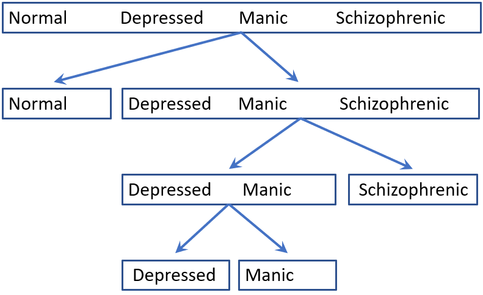

```{r, include = FALSE}
knitr::opts_chunk$set(
  collapse = TRUE,
  message = FALSE,
  warning = FALSE,
  fig.align = "center",
  fig.height = 6,
  fig.width = 7,
  fig.path = "fig/",
  dev = "png",
  comment = "#>"
)

# save some typing
knitr::set_alias(w = "fig.width",
                 h = "fig.height",
                 cap = "fig.cap")

# colorize text
colorize <- function(x, color) {
  if (knitr::is_latex_output()) {
    sprintf("\\textcolor{%s}{%s}", color, x)
  } else if (knitr::is_html_output()) {
    sprintf("<span style='color: %s;'>%s</span>", color,
      x)
  } else x
}
```

```{r setup}
library(nestedLogit)
library(knitr)
library(car)
library(broom)
```

## Models for polytomous responses

### Multinomial model
For a categorical ("_polytomous_") response variable with more than two response categories, 
one natural extension of the standard logistic regression _logit_ model is the _multinomial logit_ 
(or, _generalized logit_) model.
When the polytomous response has $m$ levels, the multinomial logit model is comprised of
$m-1$ log odds comparisons with a reference level, typically the last, as described in
@Fox:2016:ARA, \S 14.2.1 and @FriendlyMeyer:2016:DDAR, \S 8.2.
The standard implementation of this model is `multinom()` in the
`nnet` package.
<!-- TODO: reference R packages -->

### Nested logit model
A sometimes simpler approach, called _nested dichotomies_, is to fit a collection of $m-1$ 
separate models for each of a hierarchically nested set of binary comparisons among the
response categories.  This is simpler, because it uses the familiar logistic regression model
for each of the dichotomies. Taken together, this set of $m-1$ models comprises a complete
model for the polytomous response, just as does the multinomial logit model.

However, by the construction of **nested** dichotomies, the submodels are statistically independent,
so that test statistics, such as the likelihood ratio $G^2$ tests and tests for
individual coefficients can be added to give overall tests for the full polytomy.

This is illustrated in the figure below, where response categories $Y = \{1, 2, 3, 4\}$
can be divided first as $\{1, 2\}$ vs. $\{3, 4\}$. Then these dichotomies can be
divided as $\{1\}$ vs. $\{2\}$ and then $\{3\}$ vs. $\{4\}$.
Alternatively, as shown in the right side of the figure, the response categories
can be divided progressively---
first: $\{1\}$ vs. $\{2, 3, 4\}$,
next: $\{2\}$ vs. $\{3, 4\}$, and
finally: $\{3\}$ vs. $\{4\}$.


```{r}
#| nested,
#| echo = FALSE,
#| out.width="80%",
#| fig.cap = "**Nested dichotomies**: The boxes show two different ways a four-category response can be represented as three nested dichotomies."
knitr::include_graphics("fig/nested.jpg")
```

This figure makes clear that nested dichotomies are not unique or equivalent.
Different choices will have different interpretations and different fitted probabilities.
Such models make the most sense when there are substantive reasons for considering the response
categories in terms of such dichotomies. For example, in the diagram above at the right, this would make sense if the categories were _ordered_, $1 < 2 < 3 < 4$, so each of the three submodels can be interpreted as `above_1`, `above_2`, `above_3`.
<!-- $\mathrm{above}: \{1, 2, 3}$. -->

For another example, the figure below shows a case where psychiatric patients
are classified into four diagnostic categories.  These might be considered
ordered categories and dichotomized as in the 4-category above.
However, it might make better sense to dichotomize the non-normal groups into
a comparison of the depressed and manic group vs. schizophrenic and then
a final contrast of the depressed and manic categories.

```{r}
#| nested-psychiatric,
#| echo = FALSE,
#| out.width="70%",
#| fig.cap = "**Psychiatric classification**: The figure shows how four diagnostic categories might be represented by nested dichotomies."

```

## Example: Women's labor force participation

For a main example, we consider the data set `Womenlf` from the `carData` package.
This data gives the responses of 263 women from a 1977 survey carried out by
the York University Institute for Social Research. The variables are:
<!-- TODO: cite Social Change in Canada Project -->

* `partic`: labor force participation, the response, with levels
  + `fulltime`: working full-time
  + `not.work`: not working outside the home
  + `parttime` : working part-time.

* `hincome`: Husband's income, in \$1,000s
* `children`: Presence of children in the home, `absent` or `present`
* `region`: Region of Canada (not used here)

The response, `partic` is a factor, but the levels are ordered
alphabetically. To correct this, we make it an ordered factor.

```{r order-partic}
library(dplyr)
data(Womenlf, package = "carData")
Womenlf <- Womenlf |>
  mutate(partic = ordered(partic, 
                          levels = c("not.work", "parttime", "fulltime")))

table(Womenlf$partic)
```
### Defining dichotomies

It is at least arguable to consider a woman's labor choice as first involving
a dichotomy (`work`) between women who are not working vs. those who are
(part time or full time). A second dichotomy (`full`) contrasts those who work
full time vs. part time, but among only those who work.

the two binary variables can be created by recoding `partic` in the data frame
as follows.  
```{r recode}
Womenlf <- Womenlf |>
  mutate(work = ifelse(partic=="not.work", 0, 1)) |>
  mutate(full = case_when(
    work & partic == "fulltime" ~ 1,
    work & partic == "parttime" ~ 0)
  )
```

Note that the full sample of `r nrow(Womenlf)` cases is available for the `work` dichotomy,
while only `r sum(Womenlf$partic != "not.work")` cases are involved in the distinction between
part time and full time work.

```{r xtabs}
xtabs(~ partic + work, addNA=TRUE, data=Womenlf)
xtabs(~ partic + full, addNA=TRUE, data=Womenlf)
```


We could then fit the separate models for these dichotomies manually:

```{r submodels}
mod.work <- glm(work ~ hincome + children, family=binomial, data=Womenlf)
mod.full <- glm(full ~ hincome + children, family=binomial, data=Womenlf)
```

But then, it would be difficult to obtain tests for the combined model,
get and plot predicted values and so forth.

### Using `dichotomy()` and `logits()`
Instead, the `nestedLogit` package provides an easier way. The `dichotomy()` function
creates a list of length two defining a single dichotomy. The `logits()` function
uses $m-1$ calls to `dichotomy()` to create a list of class `dichotomies`
containing the symbolic representation of these contrasts among the response categories.

```{r comparisons}
comparisons <- logits(work=dichotomy("not.work", c("parttime", "fulltime")),
                      full=dichotomy("parttime", "fulltime"))

comparisons
```
For convenience, there are functions to convert these dichotomies to a matrix or to
a character string representing the tree structure of the dichotomoies.

```{r}
as.matrix(comparisons)
as.character(comparisons)
```

### Fitting the nested logit model

To fit the model, we specify the `comparisons` argument as the `dichotomies` argument.
```{r mod.nested}
mod.nested <- nestedLogit(partic ~ hincome + children, 
                          dichotomies = comparisons,
                          data=Womenlf)
```

The result, `mod.nested` is a list containing the details of the model for the nested
dichotomy. The `models` component contains results equivalent to what was fit manually
above as `mod.work` and `mod.full`.

```{r names}
names(mod.nested)
names(mod.nested$models)
```

### Methods

As befits a model-fitting function, the package defines a nearly complete set of methods for class `nested` objects:

* `print()`, `summary()`: prints the results for each of the submodels
* `update()` re-fits a model, allowing changes in the model `formula`, `data`, `subset`, and `contrasts`.
* `coef()` returns the coefficients for the predictors in each dichotomy
* `vcov()` returns the variance-covariance matrix of the predictors
* `anova()` provides ANOVA Type I (sequential) tests for each dichotomy and for the combined model. When given a sequence of objects, anova tests the models against one another in the order specified.
* `Anova()` uses `car::Anova()` to provide ANOVA Type II (partial) tests for each dichotomy and for the combined model.
* `predict()` obtains predicted probabilities for the response categories, useful for producing plots to aid interpretation.
* `glance()`, `tidy()` are extensions of `broom::glance.glm()` and `broom::tidy.glm()` to obtain compact summaries of a `nested` model object`.

To illustrate some of these:

## `predict()` and plotting


## References


